# Phase 2 – Teil 1: Ist-Datenmodell, Ziel-ER-Modell, Tabellenkatalog, Auth/Permissions

Status: **PLANUNG – keine Umsetzung.** Kein SQL wurde gegen Supabase ausgeführt, keine Tabelle angelegt, keine Produktionsdaten verändert. Alle Angaben sind gegen den tatsächlichen Code verifiziert (Grep/Read auf `index.html`, Stand Commit `93ee5ea`), nicht erfunden.

---

## 1. Executive Summary

Das ERM ist heute ein Single-Tenant-System mit einem einzigen JSON-Blob (`erm_data.payload`) als Datenquelle für ~20 Top-Level-Bereiche. Das Datenmodell ist inhaltlich bereits sehr durchdacht (z.B. eine echte Geometrie-Engine fürs Aufmaß, ein durchgängiges Pflichtdokumente-System, eine bereits vorhandene Trennung zwischen technischer ID und geschäftlicher Nummer bei Rechnungen). Das eigentliche Risiko liegt nicht in der Fachlichkeit, sondern in der **Persistenzarchitektur**: Alle Nutzer schreiben denselben Blob, es gibt keine RLS-Differenzierung nach Rolle, und ein sensibles Modul (Passwörter) speichert Klartext-Zugangsdaten im selben Blob. Phase 2 plant den Weg zu einem relationalen Modell, ohne die App auf einmal umzubauen.

---

## 2. Vollständiges State-Inventar

Basis: `defaultState()` (aktuell in `index.html`, nicht mehr extrahiert – reine Datenstruktur, kein Utility-Kandidat). Für jeden Key: Struktur anhand tatsächlicher `push()`/Formular-Fundstellen verifiziert, nicht anhand des Namens geraten.

| Key | Typ | Kernfelder (verifiziert) | Aktiv gelesen/geschrieben | Hauptmodul | Dateien/Base64? | Sensibel? | Vorgeschlagene Tabelle | Priorität |
|---|---|---|---|---|---|---|---|---|
| `firma` | Objekt | name, slogan, strasse, plz, ort, tel, email, web, iban, bic, bank, steuernr, ustid, geschaeftsfuehrer, amtsgericht, hrb, logo, logoAspect, icon | Ja/Ja | Einstellungen, PDF-Header überall | Ja (logo/icon als DataURL) | Mittel (Bankdaten) | `companies` | MUST HAVE |
| `mitarbeiter` | Array | id, vorname, nachname, name, position, abteilung, rolle, tel, email, adresse, geburtstag, eintritt, brutto, urlaubstageJahr, stundenlohn, vertragstyp, status, dokumente[], authUserId | Ja/Ja | Mitarbeiter, Zeiterfassung, Auth-Matching | Ja (`dokumente[]`) | **Hoch** (Lohn, Gesundheitsdaten in Pflichtdokumenten) | `employees` | MUST HAVE |
| `zeiterfassung` | Array | id, mitarbeiterId, datum, kommen, gehen | Ja/Ja | Stempeluhr, Stundenzettel | Nein | Mittel | `time_entries` | SHOULD HAVE |
| `urlaubsantraege` | Array | id, mitarbeiterId, von, bis, tage, status, kommentar, unterschrift, unterschriftArbeitgeber | Ja/Ja | Urlaub | Ja (2 Unterschrift-PNGs) | Niedrig | `leave_requests` | SHOULD HAVE |
| `onboarding` | Array | id, mitarbeiterId, betreuer, start, items[{text,done}], abgeschlossen | Ja/Ja | Onboarding | Nein | Niedrig | `onboarding_records` | LATER |
| `onboardingVorlagen` | Array | items[] (Text-Liste) | Ja/Ja | Onboarding-Vorlagen | Nein | Niedrig | `onboarding_templates` | LATER |
| `kunden` | Array | id, name, ansprechpartner, tel, email, adresse, notizen, dokumente[] | Ja/Ja | Kunden, Projekt-Zuordnung | Ja | Mittel | `customers` | MUST HAVE |
| `subunternehmer` | Array | id, firma, ansprechpartner, tel, email, gewerk, notizen, dokumente[] | Ja/Ja | Subunternehmer, Ausschreibung | Ja | Mittel | `subcontractors` | MUST HAVE |
| `tagesaufgaben` | Array | – | **Nein/Nein – Dead Code (Phase 1 bestätigt)** | – | – | – | *entfällt* | – |
| `planung` | Array | id, mitarbeiterId, datum, projektId | Ja/Ja | Plantafel | Nein | Niedrig | `staff_schedule_entries` | SHOULD HAVE |
| `projekte` | Array | siehe Abschnitt 3 (eigener Tiefenanalyse-Abschnitt) | Ja/Ja | Zentrales Modul | Ja (mehrfach verschachtelt) | Hoch | `projects` + 10+ Kindtabellen | MUST HAVE |
| `aufgaben` | Array | id, titel, beschreibung, faellig, prioritaet, projektId, zugeordnet, status | Ja/Ja | Aufgaben, Projekt-Übersicht | Nein | Niedrig | `tasks` | MUST HAVE (Pilot-Kandidat, siehe Teil 3) |
| `baustellenchat` | Array | id, autor, text, zeit | Ja/Ja | Baustellen-Chat (firmenweit) | Nein | Niedrig | `company_chat_messages` | LATER |
| `dokumente` | Array | id, name, dataURL, projektId, datum | Ja/Ja | Verwaltung > Dokumente (zentral) | Ja | Mittel | `documents` (category="sonstige", kein Projektbezug zwingend) | SHOULD HAVE |
| `rechnungen` | Array | id, nr, kundeId, projektId, datum, faellig, status, positionen[{beschreibung,menge,einheit,preis}], notiz, unterschrift | Ja/Ja | Rechnungen | Ja (Unterschrift) | **Hoch** (steuerrelevant) | `invoices` + `invoice_items` | MUST HAVE |
| `vertraege` | Array | id, mitarbeiterId, typ, inhalt (Freitext), unterschriftAG, unterschriftAN, status | Ja/Ja | Arbeitsverträge | Ja (2 Unterschriften) | **Hoch** (Personaldaten) | `employee_contracts` | SHOULD HAVE |
| `schluessel` | Array | id, bezeichnung, projektId, ausgegebenAn, ausgabeDatum, rueckgabeDatum, status, Unterschriften | Ja/Ja | Schlüsselprotokoll | Ja (Unterschriften) | Mittel | `key_handovers` | LATER |
| `vorlagen` | Array | id, defId, projektId, werte{}, unterschrift, datum | Ja/Ja | Vorlagen-Modul | Ja (Unterschrift) | Niedrig | `template_instances` | LATER |
| `passwoerter` | Array | id, bezeichnung, benutzername, **passwort (Klartext!)**, url, notiz | Ja/Ja | Passwörter & Zugänge | Nein | **KRITISCH** – siehe Teil 2, Abschnitt „Sensible Daten" | `credentials` (nur mit Verschlüsselungskonzept) | MUST HAVE, aber **nicht ohne Verschlüsselungsentscheidung migrieren** |
| `fuhrpark` | Array | Fahrzeugdaten, tankkosten[], schaeden[], tuev-Datum | Ja/Ja | Fuhrpark | vermutlich teilweise (Fahrzeugbild – nicht tief geprüft) | Niedrig | `vehicles` + `vehicle_fuel_logs` + `vehicle_damages` | LATER |
| `benachrichtigungen` | Array | nicht tief geprüft (Dashboard-Feed) | Ja/Ja | Dashboard | Nein | Niedrig | `notifications` | LATER |
| `einstellungen` | Objekt | rechnungNrCounter, pflichtdokumenteDefs{mitarbeiter[],subunternehmer[],kunden[]} | Ja/Ja | Einstellungen, Pflichtdokumente-System | Nein | Niedrig | `company_settings` (JSONB-Spalte reicht) | SHOULD HAVE |
| `currentUserId` | String/null | – | Ja/Ja | Auth/Session | Nein | – | *entfällt – wird durch `auth.uid()` ersetzt* | – |

**Wichtiger Korrekturhinweis gegenüber Phase 0**: `planung` wurde in Phase 1 fälschlich als möglicher Legacy-Kandidat vermutet – verifiziert **aktiv** (Plantafel-Modul). Nur `tagesaufgaben` ist tatsächlich Dead Code.

---

## 3. Projekt-Unterstruktur (Tiefenanalyse)

`projekte[i]` – Stammdaten: `id, name, kundeId, adresse, status, budget, deadline, fortschritt, geo{lat,lng,forAddress}`. Status-Werte verifiziert: `"In Planung" | "Aktiv" | "Abgeschlossen"` (siehe `PROJEKT_STATI`).

| Unterbereich | Struktur (verifiziert) | Referenzen | Eigene Tabelle? | JSONB? | Storage-Bezug | Lösch-/Archivverhalten | Erwartete Größe | RLS-Besonderheit |
|---|---|---|---|---|---|---|---|---|
| `team[]` | Array von `mitarbeiterId` (nur IDs, keine Objekte) | → `mitarbeiter.id` | **Ja** – `project_members` (N:M) | Nein | – | Bei Mitarbeiter-Austritt: Zuordnung bleibt historisch bestehen | Klein (paar Einträge/Projekt) | Sichtbarkeit an Projektzugehörigkeit koppelbar |
| `subunternehmer[]` | Array von `subunternehmerId` | → `subunternehmer.id` | Ja – `project_subcontractors` (N:M) | Nein | – | wie oben | Klein | – |
| `fotos[]` | `{id, dataURL, datum, markiert?}` | – | Ja – `project_photos` (Metadaten) | Nein (Metadaten relational) | **Ja, zwingend Storage** | Foto löschen = physisch löschen (kein steuerlicher Wert) | **Groß** (kann pro Projekt hunderte MB erreichen) | Projektzugehörigkeit |
| `dokumente[]` | `{id, name, dataURL, datum}` | – | Ja – `documents` (project_id gesetzt) | Nein | **Ja, zwingend Storage** | Soft Delete sinnvoll (können Vertragsbestandteil sein) | Mittel-Groß | Projektzugehörigkeit, evtl. Kategorie-Rechte |
| `grundrisse[]` | `{id, name, dataURL, datum}` | – | Ja – `documents` mit category="Plan" oder eigene `project_floorplans` | Nein | **Ja, zwingend Storage** | Soft Delete | Mittel | Projektzugehörigkeit |
| `material[]` (= LV-Positionen) | `{id, titel, bezeichnung, beschreibung, menge, einheit, preis, datum}` | – | **Ja, zwingend relational** – `lv_items` (Zeilen, keine große JSONB-Liste) | Nein | – | Bestandteil des LV, sollte bei LV-Versionierung mitgedacht werden | Kann groß werden (viele Positionen) | Preis-Sichtbarkeit ggf. rollenabhängig (siehe `employees.salary`-Analogie) |
| `ausschreibung[]` | `{id, subunternehmerId, versandAm, status, angebotSumme, angebotNotiz, angebotDatum}` | → `subunternehmer.id` | Ja – `subcontractor_bids` | Nein | – | Historisch aufbewahren (Ausschreibungsverlauf) | Klein | – |
| `bautagebuch[]` | `{id, datum, wetter, text, unterschrift}` | – | Ja – `site_diary_entries` | Nein | Unterschrift → Storage oder als PNG-Spalte klein genug für DB (prüfen) | Nie löschen (Beweisdokument), Soft Delete | Mittel (täglich ein Eintrag über Projektlaufzeit) | Projektzugehörigkeit |
| `zugaenge[]` | `{id, bezeichnung, info}` | – | Ja – `project_access_codes` | Nein | – | Nach Projektabschluss ggf. archivieren (enthält Codes) | Klein | **Sensibel** – wie Passwörter-Modul, siehe Teil 2 |
| `checkliste[]` | `{text, done}` **– hat KEINE `id`!** | – | Ja – `project_checklist_items`, **muss beim Migrieren eine `id` bekommen** | Nein | – | Bestandteil des Projekts | Klein | – |
| `aufmasse[]` (Räume) | `{id, name, hoehe, abzuege, segmente:[{laenge,winkel,drehrichtung}]}` – Fläche/Umfang/Wandfläche werden **client-seitig berechnet, nicht gespeichert** | – | **Hybrid**: Raum-Kopf relational (`measurements`), `segmente[]` als JSONB-Spalte (reine Geometrie-Rohdaten, kein Abfragebedarf einzeln) | Teilweise | – | Bestandteil Aufmaß-Historie | Klein-Mittel | – |
| `bauzeitenplan[]` | `{id, bezeichnung, von, bis, status, fortschritt}` | – | Ja – `project_schedule_phases` | Nein | – | Bestandteil Projektplanung | Klein | – |
| `chat[]` | `{id, autor(mitarbeiterId), text, zeit}` | → `mitarbeiter.id` | Ja – `project_chat_messages` | Nein | – | Aufbewahren, ggf. mit Retention-Policy später | Kann wachsen | Projektzugehörigkeit, Realtime-Kandidat |

**Datenqualitäts-Befund**: `checkliste[]`-Items haben keine eigene `id` – bei einer relationalen Migration muss beim Übertragen jedem Item eine neue `id` (z.B. `uid()`) vergeben werden. Das ist eine reine Migrations-Notiz, **keine Änderung am Live-Code in Phase 2**.

---

## 4. Entity-Identitäten

- **Technischer Primary Key**: `uid()` = `Date.now().toString(36) + Math.random().toString(36).slice(2,9)` – ein kurzer, zeitbasierter String, **kein UUID**, keine Kollisionsgarantie auf DB-Ebene (extrem unwahrscheinlich, aber nicht formal garantiert wie `gen_random_uuid()`). Für eine relationale Migration empfehle ich **neue `uuid`-Primary-Keys** zu vergeben und die alten `uid()`-Werte in einer `legacy_id`-Spalte zu behalten (Rückverfolgbarkeit, siehe Migrationsvalidierung Teil 3).
- **Geschäftliche Nummer bereits vorhanden**: Nur bei Rechnungen – Format `RE-<Jahr>-<4-stellig>` (z.B. `RE-2026-0042`), erzeugt über einen einzelnen globalen Zähler `S.einstellungen.rechnungNrCounter`. Das ist bereits korrekt von der technischen `id` getrennt (`r.id` ≠ `r.nr`) – gute bestehende Praxis, die im Zielmodell fortgeführt werden sollte (`invoices.id uuid`, `invoices.invoice_number text`).
- **Fehlende Nummernkreise**: Projekte, Angebote/LVs und Aufträge haben aktuell **keine** vergleichbare Geschäftsnummer, nur `p.name` als Freitext. Für ein Zielmodell mit `project_number`/`quote_number` müsste ein neuer Zähler-Mechanismus (analog zu `rechnungNrCounter`, aber pro `company_id`) eingeführt werden – als **spätere Empfehlung**, nicht in Phase 2 umzusetzen.
- Kind-IDs (z.B. `p.material[].id`, `p.fotos[].id`) folgen demselben `uid()`-Muster, sind aber nur **innerhalb ihres Elternobjekts** eindeutig referenziert (nie global gejoint) – bei Migration in eigene Tabellen werden sie zu echten globalen Primary Keys, Elternbezug über `project_id`-Fremdschlüssel.

---

## 5. Ziel-ER-Modell (Text/Mermaid)

```mermaid
erDiagram
    companies ||--o{ profiles : "hat"
    companies ||--o{ employees : "hat"
    companies ||--o{ customers : "hat"
    companies ||--o{ subcontractors : "hat"
    companies ||--o{ projects : "hat"
    companies ||--o{ invoices : "hat"
    companies ||--o{ audit_log : "protokolliert"

    profiles ||--o| employees : "auth_user_id"

    customers ||--o{ customer_contacts : "hat"
    customers ||--o{ projects : "beauftragt"

    projects ||--o{ project_members : "Team (N:M)"
    employees ||--o{ project_members : "eingesetzt in"

    projects ||--o{ project_subcontractors : "Team (N:M)"
    subcontractors ||--o{ project_subcontractors : "eingesetzt in"

    projects ||--o{ tasks : "hat"
    projects ||--o{ project_photos : "hat"
    projects ||--o{ documents : "hat"
    projects ||--o{ lv_items : "hat (LV/Material)"
    projects ||--o{ subcontractor_bids : "Ausschreibung"
    subcontractors ||--o{ subcontractor_bids : "gibt ab"
    projects ||--o{ site_diary_entries : "Bautagebuch"
    projects ||--o{ project_access_codes : "Zugänge"
    projects ||--o{ project_checklist_items : "Checkliste"
    projects ||--o{ measurements : "Aufmaß"
    projects ||--o{ project_schedule_phases : "Bauzeitenplan"
    projects ||--o{ project_chat_messages : "Chat"

    invoices ||--o{ invoice_items : "hat"
    invoices ||--o{ payments : "erhält"
    customers ||--o{ invoices : "erhält"
    projects ||--o{ invoices : "bezieht sich auf"

    documents ||--o{ document_versions : "hat"

    employees ||--o{ time_entries : "erfasst"
    employees ||--o{ leave_requests : "beantragt"
    employees ||--o{ employee_contracts : "hat"

    roles ||--o{ role_permissions : "hat"
    permissions ||--o{ role_permissions : "gehört zu"
    profiles ||--o{ roles : "hat Rolle"
```

Bewusst **nicht** aufgenommen, weil aktuell keine Fachlichkeit dafür existiert (siehe Abschnitt 6 unten): `quotes`/`orders` als eigenständige Entities (aktuell nur als KI-Import-Zwischenschritt vorhanden, siehe Teil 3), `change_orders` (Nachträge – existieren im Code nicht).

---

## 6. Tabellenkatalog

Legende: **MUST** = für Kernbetrieb nötig, **SHOULD** = wichtig, aber verschiebbar, **LATER** = klar begründbar, aber nicht dringend.

### 6.1 `companies` — MUST HAVE
Zweck: Mandantenfähigkeit vorbereiten (aktuell 1 Zeile für IB Raumkonzept).
Spalten: `id uuid PK`, `name`, `strasse`, `plz`, `ort`, `tel`, `email`, `web`, `iban`, `bic`, `bank`, `steuernr`, `ustid`, `geschaeftsfuehrer`, `amtsgericht`, `hrb`, `logo_storage_path`, `logo_aspect`, `icon_storage_path`, `created_at`, `updated_at`.
FK: keine (Wurzel-Tabelle). Indizes: keine über Volume nötig (1 Zeile heute). Soft Delete: nein (Mandant löschen ist kein Alltagsfall). RLS: jede andere Tabelle filtert auf `company_id`.

### 6.2 `profiles` — MUST HAVE
Zweck: 1:1-Bindung an `auth.users`, unabhängig von `employees` (siehe Teil 1, Abschnitt 17-Analogon unten).
Spalten: `id uuid PK` (= `auth.users.id`), `company_id FK`, `email`, `created_at`.
RLS: `id = auth.uid()`.

### 6.3 `employees` — MUST HAVE
Zweck: Ersetzt `S.mitarbeiter`.
Spalten: `id uuid PK`, `company_id FK`, `auth_user_id FK→profiles.id nullable`, `vorname`, `nachname`, `position`, `abteilung`, `rolle text` (`Mitarbeiter|Bauleiter|Geschäftsführer`), `tel`, `email`, `adresse`, `geburtstag date`, `eintritt date`, `brutto numeric(10,2)`, `urlaubstage_jahr int`, `stundenlohn numeric(8,2)`, `vertragstyp`, `status text`, `created_at`, `updated_at`, `deleted_at`.
Indizes: `(company_id, status)`, `(auth_user_id)` unique wo nicht null. Soft Delete: **ja** (Personalhistorie). RLS: **stark differenziert** – `brutto`/`stundenlohn` nur für `Geschäftsführer`-Rolle lesbar (siehe Teil 2, sensible Personaldaten).

### 6.4 `employee_documents` — SHOULD HAVE
Ersetzt `mitarbeiter[].dokumente[]`. Spalten wie `documents` (siehe 6.13), `employee_id FK`, zusätzlich `pflichttyp`, `gueltig_bis date`.

### 6.5 `customers` — MUST HAVE
`id uuid PK`, `company_id FK`, `name`, `ansprechpartner`, `tel`, `email`, `adresse`, `notizen`, `created_at`, `updated_at`, `deleted_at`. Soft Delete: ja (Rechnungshistorie hängt daran). RLS: unternehmensweit lesbar für alle authentifizierten Mitarbeiter (aktuell keine kundenspezifische Einschränkung im UI vorgesehen).

### 6.6 `customer_contacts` — LATER
Aktuell nur ein einzelnes `ansprechpartner`-Textfeld pro Kunde, keine Mehrfach-Kontakte im Code. Nur anlegen, wenn das Fachkonzept tatsächlich mehrere Ansprechpartner pro Kunde braucht – **aktuell nicht durch Code belegt**, daher LATER statt MUST.

### 6.7 `subcontractors` — MUST HAVE
`id uuid PK`, `company_id FK`, `firma`, `ansprechpartner`, `tel`, `email`, `gewerk`, `notizen`, Timestamps, `deleted_at`.

### 6.8 `projects` — MUST HAVE
`id uuid PK`, `company_id FK`, `customer_id FK nullable`, `name`, `adresse`, `lat numeric nullable`, `lng numeric nullable`, `status text`, `budget numeric(12,2)`, `deadline date`, `fortschritt smallint`, Timestamps, `deleted_at`, `archived_at`.
Index: `(company_id, status)`. Unique: keine (kein `project_number` heute – siehe Abschnitt 4).

### 6.9 `project_members` / `project_subcontractors` — MUST HAVE
Reine N:M-Zuordnungstabellen: `(project_id, employee_id)` bzw. `(project_id, subcontractor_id)`, beide mit zusammengesetztem PK.

### 6.10 `tasks` — MUST HAVE (Pilot-Kandidat, siehe Teil 3)
`id uuid PK`, `company_id FK`, `project_id FK nullable`, `titel`, `beschreibung`, `faellig date`, `prioritaet text`, `zugeordnet_employee_id FK nullable`, `status text`, Timestamps, `deleted_at`.

### 6.11 `lv_documents` / `lv_sections` / `lv_items` — MUST HAVE, aber **mit Einschränkung**
**Wichtiger Befund**: Im heutigen Code gibt es **kein eigenständiges `lv_documents`-Konzept** – ein LV ist einfach `projekte[i].material[]`, direkt am Projekt hängend, ohne Versionierung, ohne eigenen Kopf-Datensatz. Ein `titel`-Feld pro Position dient der optischen Gruppierung (z.B. „Fliesenarbeiten"), ist aber **kein eigenständiges `lv_sections`-Objekt** mit eigener ID – nur ein Freitext-String, den mehrere Positionen zufällig teilen.
→ Empfehlung: `lv_items` **jetzt** als MUST HAVE (1:1-Ersatz für `material[]`, `project_id FK`, `titel text` bleibt als einfaches Gruppierungsfeld statt eigener `lv_sections`-Tabelle). `lv_documents` (Kopf mit Versionierung, mehrere LVs pro Projekt) und `lv_sections` als **eigene Tabelle mit ID** als **SHOULD HAVE**, aber **nicht in Phase 3 Pilot** – das wäre eine Fachfunktions-Erweiterung, keine reine Migration (verstößt gegen „keine neuen Features in der Migrationsphase").
Spalten `lv_items`: `id uuid PK`, `project_id FK`, `titel text`, `bezeichnung text`, `beschreibung text`, `menge numeric(12,3)`, `einheit text`, `preis numeric(12,2) nullable`, `sortierung int`, Timestamps.

### 6.12 `measurements` — MUST HAVE
Ersetzt `p.aufmasse[]`. `id uuid PK`, `project_id FK`, `name`, `hoehe numeric(6,2)`, `abzuege numeric(8,2)`, `segmente jsonb` (siehe Begründung Teil 1 Abschnitt 3 – reine Geometrie-Rohdaten, kein Einzelabfragebedarf pro Segment), Timestamps.

### 6.13 `documents` / `document_versions` — MUST HAVE
Ersetzt `S.dokumente`, `p.dokumente[]`, `p.grundrisse[]`, `mitarbeiter[].dokumente[]`, `kunden[].dokumente[]`, `subunternehmer[].dokumente[]` **einheitlich**.
`id uuid PK`, `company_id FK`, `project_id FK nullable`, `employee_id FK nullable`, `customer_id FK nullable`, `subcontractor_id FK nullable`, `category text` (siehe Kategorie-Katalog Teil 2), `filename`, `storage_path`, `mime_type`, `size_bytes`, `pflichttyp text nullable`, `gueltig_bis date nullable`, `uploaded_by FK→profiles`, `created_at`, `deleted_at`.
`document_versions`: nur wenn Versionierung fachlich gebraucht wird (aktuell: **kein** Versionskonzept im Code, jedes Dokument ist eigenständig) – **LATER**, nicht Pilot.

### 6.14 `project_photos` — MUST HAVE
Eigene Tabelle statt Teil von `documents`, weil Fotos ein eigenes Lösch-/Kategorisierungsverhalten haben (`markiert`-Flag aus der Foto-Markierungs-Funktion). `id uuid PK`, `project_id FK`, `storage_path`, `taken_at`, `markiert boolean`, `uploaded_by`.

### 6.15 `site_diary_entries` — SHOULD HAVE
`id uuid PK`, `project_id FK`, `datum date`, `wetter text`, `text text`, `signature_storage_path nullable`, `created_by`, `created_at`. Nie hart löschen (Soft Delete Pflicht, siehe Teil 2).

### 6.16 `project_access_codes` — LATER
`id uuid PK`, `project_id FK`, `bezeichnung`, `info text` (aktuell Klartext, siehe Sicherheitsanmerkung Teil 2).

### 6.17 `project_checklist_items` — SHOULD HAVE
`id uuid PK` (**neu vergeben**, Quelle hatte keine ID), `project_id FK`, `text`, `done boolean`, `sortierung int`.

### 6.18 `project_schedule_phases` — SHOULD HAVE
`id uuid PK`, `project_id FK`, `bezeichnung`, `von date`, `bis date`, `status text`, `fortschritt smallint`.

### 6.19 `subcontractor_bids` (Ausschreibung) — SHOULD HAVE
`id uuid PK`, `project_id FK`, `subcontractor_id FK`, `versand_am date`, `status text`, `angebot_summe numeric(12,2) nullable`, `angebot_notiz text`, `angebot_datum date`.

### 6.20 `invoices` / `invoice_items` — MUST HAVE (besonders vorsichtig, siehe Teil 2)
`invoices`: `id uuid PK`, `company_id FK`, `customer_id FK`, `project_id FK nullable`, `invoice_number text` (Format `RE-JJJJ-NNNN` beibehalten), `status text` (`draft|issued|paid|cancelled` – siehe Teil 2), `datum date`, `faellig date`, `notiz`, `signature_storage_path nullable`, `issued_at timestamptz nullable`, `paid_at timestamptz nullable`, Timestamps, **kein `deleted_at`-Hard-Delete-Ersatz ohne Weiteres** (siehe Teil 2).
Unique: `(company_id, invoice_number)`.
`invoice_items`: `id uuid PK`, `invoice_id FK`, `beschreibung`, `menge numeric`, `einheit`, `preis numeric(12,2)`, `sortierung int`.

### 6.21 `payments` — MUST HAVE (fachlich neu, siehe Teil 3 – reine Datenmodell-Planung)
`id uuid PK`, `invoice_id FK`, `datum date`, `betrag numeric(12,2)`, `referenz text`, `created_by`.
**Wichtig**: Existiert im heutigen Code **nicht** – Rechnungen kennen nur `status: offen/bezahlt` als Ganzes. Das ist eine geplante Erweiterung des Datenmodells (Teilzahlungen), aber noch **keine neue Funktion**, die in Phase 2 gebaut wird – nur die Tabelle wird vorgesehen.

### 6.22 `employee_contracts` — SHOULD HAVE
`id uuid PK`, `employee_id FK`, `typ`, `inhalt text`, `signature_ag_storage_path`, `signature_an_storage_path`, `status text`.

### 6.23 `vehicles` / `vehicle_fuel_logs` / `vehicle_damages` — LATER
Nicht tief geprüft in Phase 2 (kein Pilot-Kandidat), Struktur grob aus `defaultState()`-Kommentaren übernehmbar, **vor echter Migration eigene Detailanalyse nötig**.

### 6.24 `audit_log` — SHOULD HAVE
`id uuid PK`, `company_id FK`, `user_id FK`, `entity_type text`, `entity_id uuid`, `action text`, `before_data jsonb nullable`, `after_data jsonb nullable`, `created_at`. **Nie** Passwörter/Secrets hineinschreiben (explizite Regel, siehe Teil 2).

### 6.25 `roles` / `permissions` / `role_permissions` — MUST HAVE, siehe Abschnitt 8

---

## 7. Standard-Metadaten – Begründung der Ausnahmen

Alle fachlichen Tabellen: `id, company_id, created_at, updated_at`. `created_by`/`updated_by`: bei allen Tabellen mit manueller Nutzereingabe (Projekte, Rechnungen, Dokumente, Aufgaben). **Ausnahmen**: `roles`/`permissions` (Systemtabellen, kein `company_id` nötig – global gültig), reine N:M-Zuordnungstabellen (`project_members` etc. – `created_at` reicht, kein `updated_by`, da nie inhaltlich verändert, nur gelöscht/neu angelegt).

---

## 8. Auth-Zielmodell

**Ist-Zustand** (verifiziert, Phase 0/1): `resolveAndEnter(session)` matcht `session.user.email` (kleingeschrieben) gegen `mitarbeiter[].email`. Es gibt bereits ein `authUserId`-Feld auf `mitarbeiter`, das aber **nicht** für das Matching selbst genutzt wird, sondern nur informativ mitgeführt wird (aus der Supabase-Auth-Umstellung dieser Session).

**Risiko des E-Mail-Matchings**: Ändert ein Mitarbeiter seine E-Mail in Supabase Auth (oder wird sie dort geändert), aber nicht synchron im `mitarbeiter`-Datensatz, bricht die Zuordnung.

**Zielmodell**: `employees.auth_user_id uuid FK → profiles.id` als **primäre, stabile Zuordnung**. E-Mail-Matching bleibt nur als **Fallback bei der Erstanlage** (wenn `auth_user_id` noch null ist), danach nie wieder rein E-Mail-basiert. `profiles.id = auth.users.id` 1:1. Bestehende Konten dürfen bei Migration ihre Zuordnung nicht verlieren → Migrationsschritt: für jeden `mitarbeiter` mit gesetztem `authUserId` wird beim Anlegen von `profiles`/`employees` dieser Wert direkt als `auth_user_id` übernommen, kein erneutes E-Mail-Matching nötig.

---

## 9. Rollen-/Permission-Zielmodell + Permission-Matrix

**Bestehende Rollen** (bestätigt, Phase 1): `Mitarbeiter`, `Bauleiter`, `Geschäftsführer`. `hasAdminAccess()` ist die einzige zentrale Prüfstelle (11 Aufrufstellen, keine verstreuten Vergleiche).

**Variantenvergleich**:

| Variante | Beschreibung | Vorteil | Nachteil |
|---|---|---|---|
| A. Volle RBAC-Tabellen (`roles`, `permissions`, `role_permissions`, optional `user_permissions`) | Datenbankgetriebene Matrix, änderbar ohne Deploy | Maximal flexibel, zukunftssicher für mehr Rollen | Overhead für ein System mit aktuell 3 Rollen |
| B. Rolle + fest im Code definierte Permission-Matrix (z.B. `PERMISSIONS[rolle][bereich] = [...]`), RLS liest `rolle` direkt aus `employees` | Einfach, kein zusätzliches Tabellen-Set, schnell umsetzbar | Neue Rolle = Code-Deploy nötig | Weniger flexibel bei künftig vielen Rollen |

**Empfehlung**: **Variante A, aber schlank** – `roles`/`permissions`/`role_permissions` als Tabellen, weil RLS-Policies direkt per SQL-Join gegen `role_permissions` prüfen können, ohne Rollenlogik im Client zu duplizieren (sonst müsste jede RLS-Policy die Code-Matrix in SQL nachbauen). `user_permissions` (Einzel-Ausnahmen pro Nutzer) **nicht jetzt** – YAGNI, aktuell keine Fachanforderung dafür erkennbar.

**Permission-Matrix (Entwurf, MUST-HAVE-Bereiche)**:

| Bereich | Mitarbeiter | Bauleiter | Geschäftsführer |
|---|---|---|---|
| `dashboard.view` | eigene Sicht | erweitert | voll |
| `employees.view` | ✓ (Basisdaten) | ✓ | ✓ |
| `employees.edit` | ✗ | ✗ | ✓ |
| `employees.salary.view` | ✗ (nur eigene) | ✗ | ✓ |
| `time_tracking.view/create` | eigene | Team | alle |
| `leave.view/create` | eigene | Team | alle |
| `customers.view/edit` | ✓ / ✗ | ✓ / ✓ | ✓ / ✓ |
| `subcontractors.view/edit` | ✓ / ✗ | ✓ / ✓ | ✓ / ✓ |
| `projects.view` | zugewiesene | zugewiesene | alle |
| `projects.create/edit/delete` | ✗ | ✓ / ✓ / ✗ | ✓ / ✓ / ✓ |
| `project_financials.view` | ✗ | ✗ | ✓ |
| `documents.view/upload` | zugewiesene Projekte | zugewiesene | alle |
| `documents.delete` | ✗ | ✓ (eigene Projekte) | ✓ |
| `invoices.view/create/edit/delete` | ✗/✗/✗/✗ | ✗/✗/✗/✗ | ✓/✓/✓/✓ |
| `contracts.view` | ✗ | ✗ | ✓ |
| `fleet.manage` | ✗ | ✗ | ✓ |
| `reports.view` | ✗ | eingeschränkt | ✓ |
| `settings.manage` | ✗ | ✗ | ✓ |
| `users.manage` | ✗ | ✗ | ✓ |

Deckt sich exakt mit dem heutigen `RESTRICTED_MODULES`-Verhalten (`rechnungen, vertraege, passwoerter, berichte, datev, einstellungen` nur für `ADMIN_ROLLEN`), erweitert es aber um `projects.view` = „nur zugewiesene Projekte" für `Mitarbeiter`/`Bauleiter` – **das existiert im heutigen Code noch nicht** (aktuell sehen alle eingeloggten Nutzer alle Projekte) und wäre eine **spätere fachliche Erweiterung**, keine reine Migration.

---

*(Fortsetzung: Teil 2 – Security/Storage/RLS, Teil 3 – Migrationsplan/Pilotmodul)*
